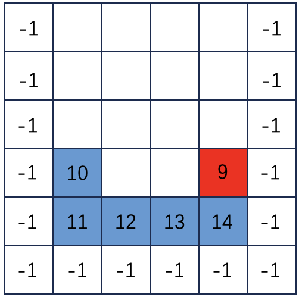
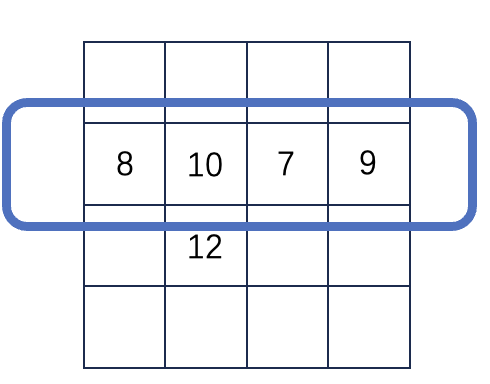
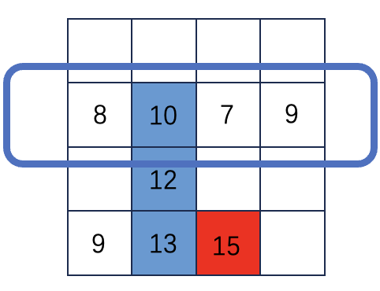

# 二维数组找峰值

## 题目描述

给定一个$m\times n$的矩阵，任意两个相邻格子的值都不相同。找出任意一个峰值，输出其坐标。为了简便，可以假设在所给矩阵的四周围着一圈值为$-1$的格子。

## 样例

输入为`[[1, 4], [3, 2]]`。很显然，可以发现$3$和$4$均为比它们的四个邻居都要大，因此它们为峰值。返回`[0, 1]`或者`[1, 0]`均可。

## 解析

### 最大值路径

在二维矩阵中，每次向比自己大的数走，所得到的路径就是最大值路径。如下图，`[10 11 12 13 14]`就是一个最大值路径。

最大值路径的最后一个数一定是二维数组的峰值。直白地理解就是，最后一个数没有地方可以走了，并且它是最大的，那么比四周都大。比如这里的$14$，就是一个峰值，因为$9$不在最大值路径中

### 二分解决这个问题

从图中标注的这一行开始二分。如果当前行$i$的最大值比其相邻的下一行$i+1$的值小，那么在$[i+ 1:]$中一定会存在一个最大值路径。

如下图所示，`[10 12 13 15]`是一条最大值路径，无论15上面、右边的数是比它大还是比它小，依旧会存在最大值路径。

因此我们可以从这一行开始二分，如果满足$mat[i+1][j]>mat[i][j]$的话，那么在$[i+1:]$中一定会存在一个峰值，只需要缩小范围到`i+1`即可。

同理，假如$mat[i+1][j]<mat[i][j]$的话，在$[0:i]$中一定会存在一个最大值路径，相当于是上面的情况翻转过来了。因此仍旧可以缩小范围。

### 时间复杂度

二分行的复杂度是$O(logn)$，在行内找到最大值的操作复杂度是$O(m)$，那么总的复杂度是$O(mlogn)$。

## 实现代码

将实现代码分为三个部分`data.py`、`main.py`、`bf.py`。第一个文件是用来制造数据的，第二个文件是二分实现的代码，第三个文件是暴力求解的方法。

这样的做法是为了用对拍的方式来验证`main.py`是否是正确的，因为暴力的做法一定是正确的，只需要把所有峰值的坐标求出来，然后判断二分输出的答案是否在暴力解法输出的坐标集合中即可。

